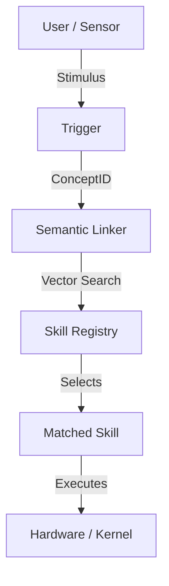

# Intent App Architecture

> [!IMPORTANT]
> This document defines the **Intent Application Framework**.
> In this OS, "Applications" are not binaries; they are **Manifests of Intent**.

## 1. The Core Philosophy

In the Intent Kernel, the operating system is not a passive resource manager; it is an **active agent** that helps the user accomplish goals.

*   **Traditional OS**: "You run the code, I'll give you memory."
*   **Intent OS**: "You tell me the goal, I'll find the code."

### "Code is an Implementation Detail"
Users (and declarative apps) should express *what* they want, not *how* to do it. The system resolves the "how" at runtime based on available Capabilities (Skills).

> [!WARNING]
> **NO IMPERATIVE LOGIC:**
> Apps MUST NOT contain imperative code (loops, if-statements, string parsing). They define a graph of Semantic Intents. Any logic must be encapsulated in a reusable **Skill** (Rust/WASM).

---

## 2. Architecture Overview

The Intent App Framework consists of three primary components:

1.  **The Intent Manifest** (`.intent`): A declarative graph defining triggers and desired outcomes.
2.  **The Semantic Linker**: A text-to-code runtime that resolves intents to skills using vector similarity.
3.  **The Skill Registry**: A collection of atomic capabilities (WASM, Drivers, Scripts) available to the system.



---

## 3. The Application Model

### 3.1 The Intent Manifest (`.intent`)

An app is simply a text file (YAML/JSON) that stitches together intents. It contains no imperative logic.

**Schema Definition**:

```yaml
app_name: "String"
version: "String"
description: "String"

# WHEN this happens...
triggers:
  - input_pattern: "Natural Language Pattern"
    intent_override: "ConceptID (Optional)"
    parameters: [Type]

# ...DO this graph of actions
flow:
  - id: "step_1"
    goal: "Natural Language Description of Action"
    inputs: ["$trigger.data"]
    
  - id: "step_2"
    goal: "Next Action Description"
    inputs: ["$step_1.result"]
```

### 3.2 The Skill (Capability)

Skills are the atomic units of execution. They are the only "code" in the system.

**Types of Skills**:
1.  **Kernel Skills**: Built-in drivers (Network, FileSystem, Steno).
2.  **WASM Skills**: Sandboxed modules downloaded from a repository.
3.  **Remote Skills**: API calls to cloud services (LLMs, Databases).

**The Skill Interface** (Rust):

```rust
pub trait Skill {
    /// Human-readable (semantic) name of the skill
    fn name(&self) -> &str;
    
    /// The vector embedding describing what this skill does
    fn semantic_embedding(&self) -> Vector;
    
    /// Execute the skill with the given intent and context
    fn execute(&self, intent: ConceptID, ctx: &Context) -> Result<Output>;
}
```

---

## 4. The Semantic Linker

The Semantic Linker is the **"JIT Compiler for Intent"**.

Instead of linking symbols (`_printf`) at compile time, it links **Semantics** at runtime.

### Resolution Process:
1.  **Manifest Step**: `goal: "Play some jazz music"`
2.  **Linker**: Embeds "Play some jazz music" -> Vector `V`.
3.  **Registry Lookup**: Finds nearest neighbors to `V`.
    *   *Candidate A*: `SpotifySkill` (Dist: 0.1)
    *   *Candidate B*: `MP3PlayerSkill` (Dist: 0.2)
    *   *Candidate C*: `SystemBeep` (Dist: 0.9)
4.  **Binding**: Linker binds the step to `SpotifySkill`.

### Dynamic Polymorphism
Because binding happens at runtime:
*   If the user installs a new, better music player, the **same manifest** automatically uses it.
*   If the cloud is offline, the linker can fallback to a local alternative seamlessly.

---

## 5. Security Model

Intent Apps are secure by default because they **cannot execute arbitrary code**. They can only request the *system* to execute a Skill.

1.  **Manifest Scanning**: Manifests are text; they can be scanned for malicious patterns before loading.
2.  **Skill Sandboxing**: All 3rd-party skills run in WASM sandboxes.
3.  **User Confirmation**: The Linker asks for permission before binding sensitive intents (e.g., "Allow 'Calorie Tracker' to access 'Camera'?").

---

## 6. Example: "Smart Doorknob" App

**Manifest**:
```yaml
app_name: "Smart Doorknob"
triggers:
  - input: "Camera detects a face" 
flow:
  - id: "chk_face"
    goal: "Identify the person"
    inputs: ["$trigger.image"]
  
  - id: "decide"
    goal: "Check if person is allowed"
    inputs: ["$chk_face.name"]
    

  - id: "action"
    goal: "Unlock the door"
    condition: "$decide.is_allowed == true"

---

## 7. Semantic Media Architecture

In the Intent Kernel, rich media (Images, Audio, Video) are **First-Class Semantic Primitives**. They are not files; they are **Concept-Linked Data**.

> See [SEMANTIC_MEDIA.md](SEMANTIC_MEDIA.md) for the technical specification of Blob Storage and Zero-Copy Pipelines.

### 7.1 Concept-Linked Data
Media is always associated with a **ConceptID**.
*   **Storage**: The `SemanticMemory` system stores the *metadata* (resolution, duration, semantic tags) and a *pointer* to the raw data blob (on disk or network).
*   **Retrieval**: You don't ask for `video.mp4`; on the manifest you ask for `ConceptID(Vacation2023)`.

### 7.2 Media Intents
Apps control playback via standard intents:

| Intent | Payload | Effect |
| :--- | :--- | :--- |
| **`MEDIA_PLAY`** | `{ concept_id: ID, timestamp: u64 }` | Starts playback in an **Immersive Projection**. |
| **`MEDIA_PAUSE`** | `{ concept_id: ID }` | Pauses playback. |
| **`MEDIA_SEEK`** | `{ position: u64 }` | Jumps to timestamp. |
| **`MEDIA_ANALYZE`** | `{ concept_id: ID }` | Requests AI analysis (Computer Vision/Audio) on the stream. |

### 7.3 Zero-Copy Pipeline
The kernel optimizes media flow for low latency:
1.  **Decoder**: Decodes frames to a GPU/DMA buffer.
2.  **Projection**: The buffer is passed *directly* to the Visual Layer's compositor.
3.  **Display**: The Hardware Composer overlays video on the screen.
**Result**: No CPU copying of pixel data.

```

**Runtime Execution**:
1.  `Camera detects face` -> Triggers OS.
2.  `Identify person` -> Linker binds to local `FaceRec_Model_v2`.
3.  `Check allowed` -> Linker binds to `FamilyDatabase`.
4.  `Unlock user` -> Linker binds to `ServoController`.
