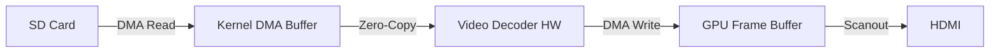
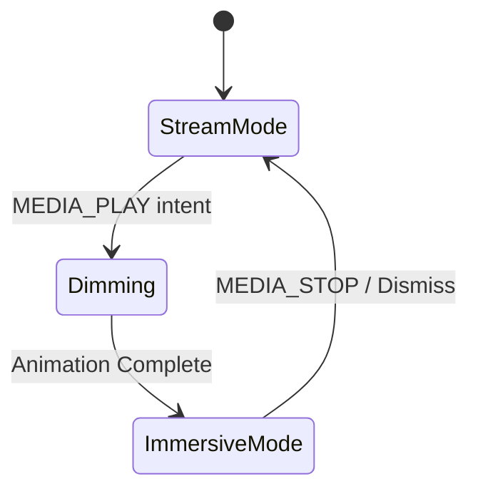

# Semantic Media Architecture

> [!IMPORTANT]
> This document details the implementation of **Media as a Semantic Primitive**.
> It defines how the Intent Kernel handles large binary blobs (Video, Audio, Images) without a traditional filesystem.

## 1. Concept-Linked Data (Blob Storage)

In the Intent Kernel, we do not have filenames (`movie.mp4`). We have **Concepts** (`HolidayVideo2023`) that own **Data Blobs**.

### 1.1 The Semantic Blob (`SemanticBlob`)
A `SemanticBlob` is a contiguous sequence of sectors on the storage medium (SD Card) that contains raw binary data.

```rust
pub struct SemanticBlob {
    pub concept_id: ConceptID,  // The owner
    pub mime_type: MimeType,    // e.g., Video/H264
    pub size_bytes: u64,
    pub start_sector: u64,      // Physical location
    pub sector_count: u64,
    pub encryption_iv: [u8; 16], // Optional encryption
}
```

### 1.2 The Blob Index (`BlobIndex`)
The kernel maintains a B-Tree index mapping `ConceptID` to `SemanticBlob` metadata. This index is cached in RAM for O(log N) retrieval.

**Deduplication**:
If multiple concepts (e.g., `FunnyCat` and `MyFavoriteVideo`) refer to the same content, they point to the same `start_sector`. This provides inherent data deduplication.

---

## 2. The Zero-Copy Pipeline

The critical requirement for media is **Latency**. We must avoid copying pixel data between kernel, user space, and GPU.

### 2.1 Architecture



### 2.2 The `ZeroCopyBuffer`
This RAII struct manages physical memory pages that constitute a buffer.

```rust
pub struct ZeroCopyBuffer {
    pub phys_addr: usize,
    pub size: usize,
    _private: (), // Prevent external construction
}

impl Drop for ZeroCopyBuffer {
    fn drop(&mut self) {
        // Automatically return pages to the physical allocator
        // only when the Hardware confirms completion.
    }
}
```

### 2.3 The Media Scheduler
A dedicated kernel subsystem that streams data.

1.  **Prefetch**: Reads upcoming sectors from SD Card into `ZeroCopyBuffer`s using DMA.
2.  **Dispatch**: Submits buffers to the HW Decoder command queue.
3.  **Recycle**: Reclaims buffers once the decoder releases them.

---

## 3. Immersive Projections

When a media intent is triggered, the SVI transitions to an **Immersive Mode**.

### 3.1 State Machine



*   **StreamMode**: Standard UI (Cards, Lists).
*   **Dimming**: A 200ms transition where the UI stream fades out and the "Stage" background darkens.
*   **ImmersiveMode**: The Media Projection renders directly to the primary hardware plane (Plane 0), bypassing the UI compositor (Plane 1) for maximum performance.

### 3.2 Controls (HUD)
User controls (Play/Pause, Seek) are rendered by the SVI as specific "HUD Cards" on the UI Plane (Plane 1), floating *above* the video content.

---

## 4. API Usage

### 4.1 Creating Media (Ingest)

```rust
// Ingest a raw stream and link it to a concept
let blob = media::ingest(
    ByteStream::new(source),
    MimeType::VideoH264
)?;

// Link to concept
blob.link_to(concepts::VACATION_VIDEO);
```

### 4.2 Playing Media

```rust
// Broadcast intent
let intent = Intent::new(concepts::MEDIA_PLAY)
    .with_target(concepts::VACATION_VIDEO);

intent::broadcast(intent);
```

---

## 5. Security

*   **Content Verify**: Since blobs are immutable after writing, we can store a Merkle Tree root hash in the `SemanticBlob` struct to verify integrity on read.
*   **Access Control**: Standard Semantic Security applies. If a user cannot access `ConceptID(X)`, they effectively cannot access the blob data attached to it.
