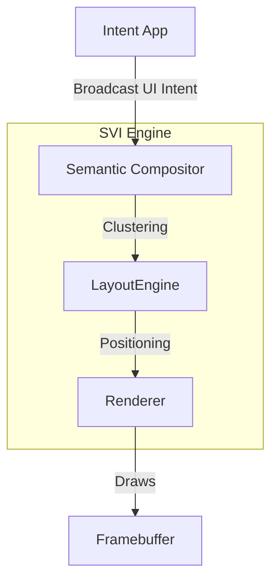

# Semantic Visual Interface (SVI 2.0)

> [!IMPORTANT]
> **SVI 2.0 is an Active Projection Engine.**
> In this OS, Applications **do not draw windows**. They broadcast **UI Intents**, and the OS renders them.

## 1. The Philosophy: "The OS Draws the UI"

In traditional operating systems, the Window Manager manages rectangles (windows) drawn by applications.
In the **Intent Kernal**, the UI is a **Semantic Projection** of the system's state.

*   **Old Way**: App says "Draw a 400x300 window at (10,10) and fill it with these pixels."
*   **SVI Way**: App says "I have a result: 'Apple, 95kcal'." (The OS decides *how* to show it).

### Why?
1.  **Consistency**: Every "Card" looks identical because the OS draws it.
2.  **Multimodality**: A "Result" can be displayed on a screen, spoken via TTS, or projected onto AR glasses without the app changing.
3.  **No "Window Management"**: The user never drags, resizes, or minimizes windows. The OS manages the information flow.

---

## 2. Architecture

The SVI is a pipeline that transforms **semantic data** into **visual projections**.



### 2.1 The UI Intents
Apps do not have access to the framebuffer. They interact with the user by broadcasting specific **UI Intents**.

| Intent Class | Purpose | Payload Example |
| :--- | :--- | :--- |
| **`UI_SHOW_CARD`** | Display a discrete unit of information. | `{ title: "Apple", body: "95 kcal", image: "url" }` |
| **`UI_SHOW_LIST`** | Display a collection of items. | `{ items: ["Result A", "Result B"] }` |
| **`UI_ASK_INPUT`** | Request data from the user. | `{ prompt: "What did you eat?", type: "Text" }` |
| **`UI_UPDATE_STATUS`** | Show background progress. | `{ task: "Syncing", percent: 45 }` |
| **`UI_ALERT`** | Interrupt with urgent info. | `{ message: "Battery Low", level: "Critical" }` |

### 2.2 The Semantic Compositor
The Compositor receives valid UI Intents and decides their lifecycle.

*   **Deduplication**: If two apps broadcast the same "Result", show it once.
*   **Prioritization**: Urgent alerts overlay passive cards.
*   **Persistence**: "Transient" cards fade away (e.g., "Copied to clipboard"). "Persistent" cards stay until dismissed (e.g., "Music Playing").

### 2.3 The Layout Engine (Semantic Clustering)
The OS arranges projections based on **Meaning**, not app ownership.

*   **Cluster by Topic**: Accessing a "Food Log" app and a "Calorie Database" skill might show two cards side-by-side because they share the `nutrition` context.
*   **The "Stream"**: The primary view is an infinite chronological stream of Intents and Results (like a chat history with the OS).
*   **The "Stage"**: The active workspace where persistent tools live.

### 2.4 Immersive Projections (Semantic Media)
For rich media (Video, Games, Full-screen Images), the SVI uses **Immersive Projections**.
> See [SEMANTIC_MEDIA.md](SEMANTIC_MEDIA.md) for details on the Immersive State Machine.
*   **Behavior**: When `MEDIA_PLAY` is broadcast, the "Stream" dims, and the content takes over the **Stage**.
*   **Controls**: Playback controls are overlay "Cards" that float above the immersive layer.
*   **Performance**: Immersive projections enjoy a **Zero-Copy** path from the decoder to the display hardware.

---

## 3. Standard Projections (The Widget Kit)

These are the visual primitives built into the OS.

### 3.1 The Card
The atomic unit of UI.
*   **Header**: Icon + Title (derived from Skill Name).
*   **Body**: Text content.
*   **Actions**: Standard buttons (e.g., "Open", "More", "Dismiss").

### 3.2 The Input Box
A ephemeral overlay that appears when an app requests `UI_ASK_INPUT`.
*   Input is routed *only* to the requesting intent for that session.
*   once satisfied, it dissolves.

### 3.3 The Steno Tape
(System Level) A distinct, always-on-top overlay showing the raw input stream. This is the only "Chrome" that is permanently fixed.

---

## 4. Example Flow: "Weather Check"

1.  **User Trigger**: User types "weather sf".
2.  **App Logic**: `WeatherSkill` fetches data.
3.  **UI Broadcast**: `WeatherSkill` emits:
    ```json
    Intent: UI_SHOW_CARD
    Payload: {
      "title": "San Francisco",
      "temp": "65°F",
      "icon": "cloudy"
    }
    ```
4.  **Compositor**: Checks if a weather card is already showing. If not, creates a new Projection ID.
5.  **Layout**: Places the card at the bottom of the "Stream".
6.  **Renderer**: Draws the card using the system theme (e.g., Dark Mode Glassmorphism).

---

## 5. Backward Compatibility
> **There is none.**
> Legacy X11/Wayland apps are **not supported**. 
> To put pixels on the screen, you *must* use the Intent System.
