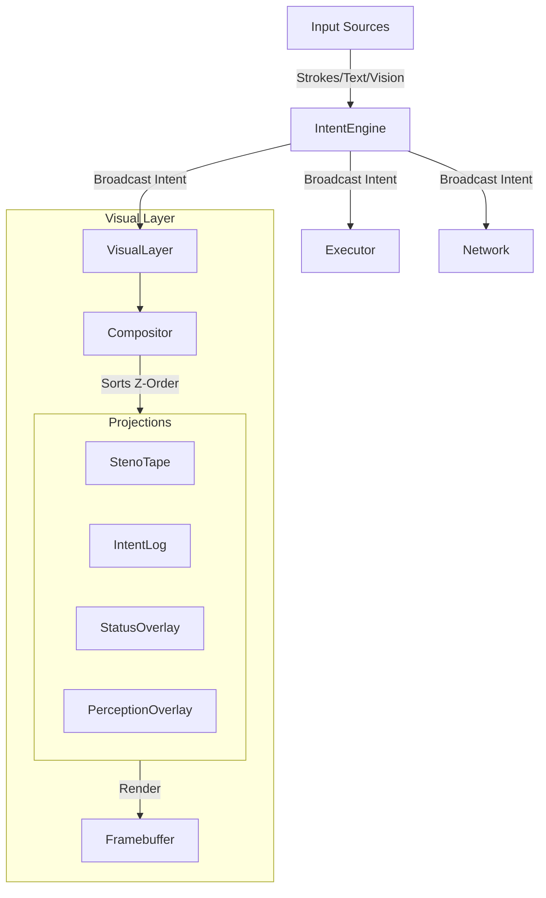

# Semantic Visual Interface (SVI)

The **Semantic Visual Interface (SVI)** is the visual projection layer of the Intent Kernel. Unlike traditional window managers that drive the OS, the SVI is a **Broadcast Listener** that reflects the semantic state of the kernel.

## Core Philosophy

1.  **Intent-Driven**: The interface updates in response to semantic intents (`ConceptID`), not just raw input events.
2.  **Projections, Not Windows**: Visual elements are ephemeral "projections" that appear when needed and dissolve when irrelevant.
3.  **Semantic Layout**: (Planned) Visual elements arrange themselves based on semantic similarity (HDC), clustering related concepts together.

## Architecture

The Visual Layer sits alongside other intent handlers (Executor, Logger, Network).

### The Visual Layer
Located in `kernel/src/visual/`, the Visual Layer manages the lifecycle of projections. It registers as a **wildcard intent handler**, allowing it to observe every intent flowing through the system.

### Projections
A `Projection` is a trait that defines a visual element:
- **`responds_to()`**: Which concepts trigger this projection?
- **`on_intent()`**: Update state based on an intent.
- **`on_stroke()`**: Update state based on raw steno input.
- **`render()`**: Draw to the framebuffer.

## Core Projections

| Projection | Description | Trigger |
| :--- | :--- | :--- |
| **StenoTape** | Real-time visualization of raw steno strokes. | *Always Active* |
| **IntentLog** | History of recognized semantic intents. | *Always Active* |
| **Status** | System statistics (CPU, Memory, Stroke count). | `STATUS` intent |
| **Help** | Modal overlay showing available commands. | `HELP` intent |
| **Perception** | Visualizes active sensors and object detection. | *Always Active* |
| **MemoryGraph** | Visualizes HDC neural memory nodes. | *Always Active* |

## Usage

The SVI is active by default on boot. It renders to the primary framebuffer (HDMI/DSI).

### Commands
- **Show Status**: Type `status` or steno `STAT`.
- **Show Help**: Type `help` or steno `PH-FPL`.
- **Clear Screen**: Type `clear` or steno `KHR*`.

## Future Roadmap
- **HDC Layout**: Use hypervector similarity to position projections.
- **Semantic Zoom**: Reveal more detail as the user "zooms" into a concept.
- **Intent History Timeline**: A visual scrubber for past intents.
