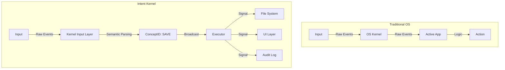

# The Death of the Dumb Pipe: Why We Need Intent-Driven Operating Systems
*Part 1 of the Intent-Driven Architecture Series*

**Current Operating Systems have failed us.**

It’s a bold claim, but look at your computer right now. What is it really doing? It’s waiting. It’s polling a USB controller for keycodes. It’s painting pixels. But it has absolutely no idea *what you are trying to do*.

For the last 40 years, we have treated the Operating System as a "Dumb Pipe"—a glorified traffic cop that shuffles bytes from a keyboard to a browser, or from a disk to RAM. It manages resources, but it ignores the most important resource of all: **User Intent**.

We are building something different. We call it the **Intent Kernel**, and it represents a fundamental shift in how we think about computing.

## The Problem: The "Application Silo"

In a traditional OS (Linux, Windows, macOS), the flow of information looks like this:

1.  **Input**: User presses "Ctrl+S".
2.  **OS**: Sees raw keycode `17` + `31`.
3.  **OS**: Delivers keycode to the focused window (e.g., VS Code).
4.  **App**: Decides "Oh, that means Save."

The OS is blind. It doesn't know you saved a file. It doesn't know you’re working on a project. It just passed a message. This leads to disjointed workflows where every application reinvents the wheel, and the system can't help you because it doesn't understand you.

## The Solution: Intent-Driven Architecture

In an Intent-Driven Operating System, we invert this model. The OS is not a pipe; it is a **Perceptual Computing Platform**.

### Core Philosophy: The Semantic Layer

Instead of passing raw *events* (Key Down, Mouse Click), the kernel processes *semantics*.

1.  **Input**: User presses "Ctrl+S" (or types "save", or speaks "save this").
2.  **Kernel Input Layer**: Recognizes the **Intent**.
3.  **Kernel Core**: Broadcasts a system-wide `SAVE` signal (ConceptID).
4.  **Listeners**:
    *   The File System persists the data.
    *   The UI displays a "Saved" animation.
    *   The Version Control system creates a local snapshot.
    *   The Neural Memory reinforces the link between "Save" and this context.

The OS is aware. It understands that a `SAVE` event occurred, regardless of how it was triggered.

## The "No Hybrid" Rule

To make this work, we enforce a strict architectural rule: **No Hybrid Implementations.**

There are no "backdoors" for apps to sniff raw keys. Every single user interaction must pass through the Intent System.
*   **Steno Machine?** Maps to ConceptIDs.
*   **Natural Language?** Parsed to ConceptIDs.
*   **Vision System?** Sensor fusion maps objects to ConceptIDs.

This guarantees that the system is always in a known semantic state. There are no "hidden" actions.

## System 1 and System 2 Computing

We drew inspiration from Daniel Kahneman’s *Thinking, Fast and Slow*. The Intent Kernel models the computer as a biological brain with two distinct systems:

### System 1: The Reflex Arc (The Kernel)
*   **Speed**: Microseconds (<100 cycles).
*   **Mechanism**: Fast, deterministic lookup tables (hash maps, tries).
*   **Role**: Handling Steno input, immediate commands (`ls`, `cd`, `stop`), and safety overrides.
*   **Feel**: Instantaneous. Muscle memory.

### System 2: The Cognitive Engine (The LLM)
*   **Speed**: Milliseconds to Seconds.
*   **Mechanism**: Large Language Models (Llama, GPT).
*   **Role**: Resolving ambiguity, planning complex tasks ("Refactor this file to use the new API"), and creative generation.
*   **Feel**: Thoughtful. Deliberative.

The Kernel runs System 1 on the bare metal. System 2 runs as a background process, fed by the context from System 1. This prevents the "AI Latency" problem—your keyboard never lags because the LLM is thinking.

## Why This Matters

We are moving toward a world of agents. If every AI agent has to scrape the screen or hook into accessibility APIs to understand what's happening, we will create a fragile, slow mess.

An Intent-Driven OS provides a **native language for Agents**. It exposes the state of the world not as pixels, but as Concepts. It is the foundation for the next generation of intelligent computing.

---
*Next in this series: The Broadcast Architecture—How we implemented a biological nervous system in Rust.*
