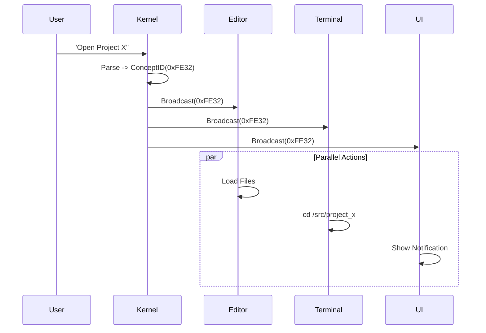

# The Nervous System of a Machine: Inside the Intent Kernel Architecture
*Part 2 of the Intent-Driven Architecture Series*

In [Part 1](./01_philosophy.md), we argued that Operating Systems need to stop being dumb pipes and start understanding user *Intent*. Today, we’re going to look at the engineering reality. How do you actually build an OS that "understands" things?

We didn't look at Linux or Windows for inspiration. We looked at biology.

## The Broadcast Architecture (1:N)

In established computing, we are obsessed with **RPC** (Remote Procedure Call) and **Point-to-Point** communication. Object A calls Object B.

Biology doesn't work like that. When you decide to "Throw a Ball", your brain doesn't send a discrete message to `bicep_left.contract()`. It broadcasts a **Motor Intent**. This signal is picked up by your arm, your core stabilizers, your eyes (for tracking), and your lungs (for breath control).

The Intent Kernel uses a **Broadcast Architecture**:

1.  **Intent**: The system generates a semantic signal (e.g., `OPEN_PROJECT`).
2.  **Broadcast**: This signal is blasted to the Semantic Bus.
3.  **Subscribers**: Any authorized component can react.
    *   **The Editor**: Opens the code.
    *   **The Terminal**: `cd`s to the directory.
    *   **The Status Bar**: Shows "Project Loaded".

This decouples the *Request* from the *fulfillment*. The user just expresses "What", and the system handles "How".

## The ConceptID: The Atom of Meaning

To make this work, we need a universal language. We can't broadcast strings like "Open Project" because strings are messy.

We introduced the **ConceptID**: a 64-bit identifier that represents a unique semantic unit.
*   `0x0001_A001`: `SAVE`
*   `0x0002_B042`: `PROJECT_ROOT`
*   `0x0003_C100`: `SYSTEM_SHUTDOWN`

Every component in the OS—from the Steno driver to the Neural Network—agrees on these IDs. This is the **Semantic Protocol**.

## The Tollbooth: Security by Intent

Traditional security is based on **Who** (User ID) and **Where** (File Permission).
Intent security adds **Why**.

Because every action travels through the kernel as a Semantic Packet, we can enforce policy at the "Semantic Tollbooth".

**The Scenario**: An unregulated script tries to delete all files.
*   **Linux**: Check `uid`. Is it 1000? Yes. `rm -rf`. Data gone.
*   **Intent Kernel**: 
    1.  Receives `DELETE_ALL` intent.
    2.  Check `RateLimit`: "This source sends too many delete intents." -> **BLOCK**.
    3.  Check `Context`: "User did not confirm this high-risk intent." -> **BLOCK**.

We can implement "Surprise-Based Security". If an action generates high *Surprise* (entropy) given the user's history, the kernel can pause execution and ask for confirmation.

## Dual Input Paths: Speed vs. Accessibility

We built the system with two distinct input paths to serve both Power Users and General Users.

1.  **The Steno Path (The Spinal Cord)**
    *   **Input**: Chorded keystrokes (multiple keys at once).
    *   **Processing**: Direct lookup in a BTreeMap.
    *   **Latency**: < 0.1 microseconds.
    *   **Use Case**: Coding at 200+ WPM. 

2.  **The English Path (The Cortex)**
    *   **Input**: "Show me the system status."
    *   **Processing**: Parser -> Synonym Expansion -> Keyword Extraction.
    *   **Latency**: ~30 microseconds.
    *   **Use Case**: Discoverability and casual usage.

Crucially, **both paths resolve to the same ConceptID**. You can type "save" or chord `S-F`, and the exact same `SAVE` intent travels through the system.

---
*Next in this series: Designing for Intent—How to write applications that plug into this nervous system.*
