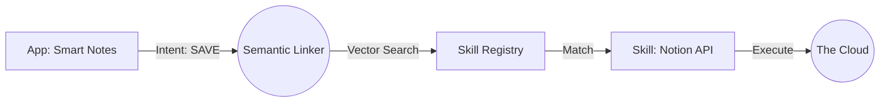

# The Semantic Linker: Architecture of an Intent Application
*Part 5 of the Intent-Driven Architecture Series*

We have discussed the Philosophy (Part 1), the Kernel (Part 2), and the Coding Style (Part 3). But we haven't answered the most critical architectural question:

**If applications don't call APIs, how do they actually get things done?**

If I write a "To-Do List" app, and I want to "Save a Task", I don't call `fwrite()`. I broadcast a `SAVE` intent. But who listens? The Hard Drive? Keybase? Dropbox? The answer lies in the most novel component of our architecture: **The Semantic Linker**.

## The Death of the Binary

In 2024, an "Application" is a binary blob. It contains:
1.  **Logic** (The unique value)
2.  **Dependencies** (The baggage)
3.  **Drivers** (The implementation details)

If you want to change the database from SQLite to Postgres, you have to rewrite the code, recompile the binary, and ship a new version.

In the Intent-Driven World, we kill the binary. An "Application" is not a blob of code; it is a **Manifest of Intent**.

## The Three Pillars of Intent Architecture

The architecture of an Intent App rests on three decoupled pillars:

### 1. The Manifest (The "What")
This is a declarative file (YAML/JSON) that describes the application's goals, not its code. It looks like a service contract.

```yaml
app_name: "Smart Notes"
intents:
  - trigger: "User types a note"
    goal: "Persist text data safely"
    constraints: ["Encrypted", "Low Latency"]
```

Notice what is missing? **Implementation.** There is no mention of SQL, Files, or Cloud. Just the *Intent*.

### 2. The Skill Registry (The "How")
The system maintains a library of atomic capabilities called **Skills**. These are the implementation units.
*   `FileSystemSkill`: Knows how to write to disk.
*   `CloudStorageSkill`: Knows how to call S3.
*   `NotionSkill`: Knows how to append to a Notion page.

These skills are small, sandboxed, and reusable. They are the "Lego bricks" of the OS.

### 3. The Semantic Linker (The "Matchmaker")
This is the magic. In a traditional OS, the **Linker** (`ld`) binds function calls at *compile time*. In the Intent OS, the **Semantic Linker** binds intents to skills at *runtime*.

## Just-In-Time Intent Resolution

Let's walk through what happens when you run your "Smart Notes" app.

1.  **Broadcast**: The app emits the `SAVE` intent with the `Encrypted` constraint.
2.  **Embedding**: The Semantic Linker converts this intent into a Vector embedding (a mathematical representation of its meaning).
3.  **Search**: It queries the **Skill Registry** for the nearest neighbor.
    *   *Candidate A*: `FileSystemSkill` (Distance: 0.2)
    *   *Candidate B*: `NotionSkill` (Distance: 0.1) - **Winner!**
4.  **Binding**: The Linker "binds" the app to the `NotionSkill` for this session.



## Why This Changes Everything

This architecture gives us **Dynamic Polymorphism** on a system level.

### 1. The "Upgrade" Problem
In the old world, if a new, faster database comes out, every app developer has to update their app.
In the Intent world, the **User** installs the `NewDatabaseSkill`. The Semantic Linker immediately sees it has a "closer distance" to the `SAVE` intent than the old one. **Every app on the system instantly upgrades to the new database without a single line of code changing.**

### 2. The "Context" Awareness
The Linker doesn't just look at the intent; it looks at the **Context**.
*   **Context: Offline?** The Linker automatically ignores cloud skills and binds to `LocalDiskSkill`.
*   **Context: High Security?** The Linker ignores unverified skills.

The application developer doesn't write `if (offline) { ... }`. The architecture handles it.

## Conclusion

The Shift involves moving from **Imperative Dependencies** (importing a library) to **Declarative Intents** (requesting a capability).

By inserting the **Semantic Linker** between the Desire and the Action, we create a system that is fluid, adaptable, and intelligent. The OS is no longer just running code; it is dynamically assembling the best possible machine to solve your problem in real-time.

---
*Next in this series: The Neural Nervous System—How we implemented "Thinking" in Rust.*
