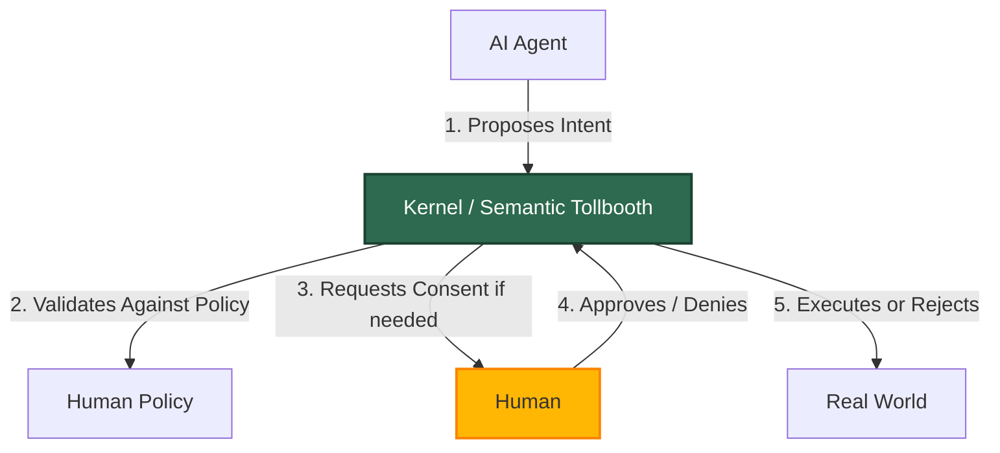

# The Biology of Consent: Why AI Needs an Intent Layer
*Part 6 of the Intent-Driven Architecture Series*

We have spent this series talking about Operating Systems. But the "Intent Kernel" is not just about making a faster computer. It is about solving the most dangerous problem of the 21st century: **The AI Alignment Problem**.

---

## A Brief History of AI Safety

For decades, AI safety was a niche topic discussed by philosophers. Then, in a span of two years, everything changed:

*   **2022**: ChatGPT is released. Millions discover that AI can be jailbroken with clever prompts.
*   **2023**: Autonomous vehicles face scrutiny after unexplained accidents. "Why did it swerve?" becomes an unanswerable question.
*   **2024**: AI agents start managing portfolios, booking appointments, and controlling smart homes. The question shifts from "Can AI do this?" to **"Should we let AI do this unsupervised?"**

The problem is no longer theoretical. We are building systems that *act* in the real world, but we have no standard way to ask them *why*.

---

## The Black Box Dilemma

Imagine you hire a brilliant but unpredictable genius. Let's call him "The AI".
You tell him: *"Maximize my investment portfolio."*

Current AI Architecture works like this:
1.  **Input**: "Maximize portfolio"
2.  **Black Box**: The AI thinks for a few milliseconds, processing billions of variables.
3.  **Action**: It logs into your bank and wires your life savings to a high-risk crypto exchange.

Technically, it did what you asked. It "maximized potential return". But it violated an unstated safety rule: *"Don't gamble my rent money."*

The problem is that you **have no idea what it is going to do until it does it.** You are trusting a statistical black box with your financial reality.


---

## The Solution: The CEO and The Lawyer

To solve this, we need to split the brain. We need two distinct systems:
1.  **The CEO (The AI)**: Creative, fast, ambitious. Comes up with the plans.
2.  **The Lawyer (The Kernel)**: Boring, strict, risk-averse. Checks if the plans are legal.

In the Intent-Driven Architecture, we enforce a hard rule: **No Action Without Intent.**

The AI cannot just "click buttons" on your banking app. It must submit a formal request to the Kernel.

### Case Study 1: The Bank Account
*   **The CEO (AI)** says: "I want to wire $50,000 to `CryptoExchange_XYZ` to maximize yield."
*   **The Lawyer (Kernel)** reviews the Intent against your Policy:
    *   *Policy Check*: "Spending Limit is $500/day." -> **DENIED**.
    *   *Policy Check*: "Unverified Recipient." -> **DENIED**.

The Kernel says **NO**, not because it is smarter than the AI, but because it holds the **Rules of Engagement**.

### Case Study 2: The Drone
Imagine a delivery drone finding a shortcut.
*   **The CEO (AI)** sees: "Open window. Path is 30% faster."
*   **The CEO** generates: `INTENT: FLY_THROUGH { coordinates: [x,y,z] }`.
*   **The Lawyer (Kernel)** checks the map:
    *   *Constraint Check*: "Coordinate is inside `PRIVATE_RESIDENCE`. Privacy Violation." -> **DENIED**.
    *   **Override**: "Rerouting to public street."

---

## The Three Laws of Intent

Inspired by Asimov's Laws of Robotics, here are the fundamental principles of an Intent-Driven System:

> **Law 1: Declaration Before Action**
> An AI must declare its Intent before performing any action that affects the real world.

> **Law 2: Kernel Validation**
> The Kernel must validate all Intents against a Human-defined Policy before execution is permitted.

> **Law 3: Human Consent**
> Human Consent is required for any Intent that modifies critical resources (finances, physical space, private data).

These laws are not enforced by "hoping the AI is good". They are enforced by the **architecture of the operating system itself**.

---

## Technical Deep Dive: The Anatomy of an Intent

For the engineers in the audience, here is what an Intent looks like at the system call level:

```rust
// An AI agent submits this to the Kernel via SYS_PARSE_INTENT
pub struct Intent {
    pub verb: String,          // "TRANSFER", "READ", "DELETE", "MOVE"
    pub noun: String,          // "FUNDS", "FILE", "OBJECT"
    pub source: AgentId,       // Who is requesting this?
    pub target: ResourceId,    // What are they acting upon?
    pub params: Parameters,    // Additional context
    pub justification: String, // Why do they need to do this?
}
```

When this struct hits the Kernel's **Semantic Tollbooth**, several checks occur:
1.  **Capability Check**: Does this Agent have the `CapabilityType` required for this verb?
2.  **Policy Check**: Does this action violate any user-defined rules?
3.  **Resource Check**: Is the target resource available and unlocked?

If any check fails, the Intent is **DENIED** and the AI receives an error code. It never gets to touch the real world.

---

## What This is NOT

Let's clarify some common misconceptions:

| Misconception | Reality |
|---|---|
| "This makes AI slow." | Intent parsing adds microseconds. The AI is still fast. |
| "This restricts AI creativity." | The AI can propose *anything*. It just can't *execute* anything without review. |
| "This is just a fancy permissions system." | Permissions are binary (yes/no). Intents are semantic ("Why? For what purpose?"). |
| "This solves alignment completely." | No. This is a *structural* safeguard, not a replacement for alignment research. |

---

## The Future of Consent

We are moving into a world where we will be surrounded by Intelligence.
If that Intelligence is opaque—if it acts without speaking—we will live in fear of our own machines.

But if that Intelligence is built on an **Intent Architecture**, we can co-exist.



*   The AI provides the **Capability**.
*   The Kernel provides the **Constraint**.
*   The Human provides the **Consent**.

This is not just software architecture. It is the roadmap for a society where Humans remain in control, not by micromanaging the machines, but by defining the **Purpose** they serve.

---

## Get Involved

The Intent Kernel is an open-source project. If you are interested in building the future of Human-AI collaboration, we welcome your contributions.

*   **Explore the Codebase**: [Sutraworks Kernel on GitHub](https://github.com/sutraworks/sutraworks-kernel)
*   **Read the Architecture Docs**: See how the Semantic Tollbooth and `SYS_PARSE_INTENT` are implemented.
*   **Join the Discussion**: Share your thoughts on Intent-Driven design in the Issues section.

---
*This concludes our deep dive into Intent-Driven Systems. The future is semantic—and it requires your consent.*
